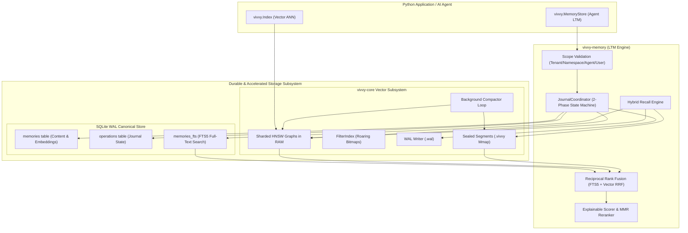

# Vivvy: Comprehensive Integration Guide

Vivvy is a local, durable long-term memory (LTM) runtime and single-machine vector engine engineered specifically for autonomous AI agents and local LLM applications. It provides zero-network, daemonless, crash-safe memory persistence combined with fast approximate nearest neighbor (ANN) vector retrieval.

This document serves as the authoritative, production-grade guide for integrating, operating, and managing Vivvy, with primary focus on Python code integration (`vivvy-py`).

---

## Table of Contents

1. [Architectural Overview & Core Invariants](#1-architectural-overview--core-invariants)
   - [Core Design Guarantees](#core-design-guarantees)
   - [Workspace Package Layout](#workspace-package-layout)
   - [System Dataflow & Layering](#system-dataflow--layering)
2. [Python Complete Code Guide (`vivvy`)](#2-python-complete-code-guide-vivvy)
   - [Installation & Build Setup](#installation--build-setup)
   - [High-Level Agent Memory (`vivvy.MemoryStore`)](#high-level-agent-memory-vivvymemorystore)
     - [1. Initializing & Opening a Store (`open`)](#1-initializing--opening-a-store-open)
     - [2. Storing Observations & Knowledge (`remember`)](#2-storing-observations--knowledge-remember)
     - [3. Memory Kinds & Semantic Categorization](#3-memory-kinds--semantic-categorization)
     - [4. Hybrid Candidate Recall & Reranking (`recall`)](#4-hybrid-candidate-recall--reranking-recall)
     - [5. Time-Window Temporal Filtering](#5-time-window-temporal-filtering-created_after_ms--created_before_ms)
     - [6. LLM Context Window Formatter (`format_context`)](#6-llm-context-window-formatter-format_context)
     - [7. Atomic Zero-Downtime Backup (`backup`)](#7-atomic-zero-downtime-store-backup-backup)
     - [8. Soft-Deleting Memories (`forget`)](#8-soft-deleting-memories-forget)
     - [9. Store Health Diagnostics (`health`)](#9-store-health-diagnostics-health)
     - [10. Resumable Physical Vacuuming (`vacuum_tombstones`)](#10-resumable-physical-vacuuming-vacuum_tombstones)
     - [11. Index Accelerator Rebuilding (`rebuild_index`)](#11-index-accelerator-rebuilding-rebuild_index)
     - [12. Optimistic Concurrent Memory Update (`update`)](#12-optimistic-concurrent-memory-update-update)
     - [13. Bulk Soft-Delete (`forget_batch`)](#13-bulk-soft-delete-forget_batch)
   - [Low-Level Vector Search Index (`vivvy.Index`)](#low-level-vector-search-index-vivvyindex)
     - [1. Index Construction & Metric Options](#1-index-construction--metric-options)
     - [2. Vector Ingestion (`insert`, `insert_batch`)](#2-vector-ingestion-insert-insert_batch)
     - [3. Metadata Filter Queries (`search`)](#3-metadata-filter-queries-search)
     - [4. Multithreading & GIL Release Characteristics](#4-multithreading--gil-release-characteristics)
3. [Python Production Agent Workflows & Patterns](#3-python-production-agent-workflows--patterns)
   - [Pattern A: RAG Context Retrieval Agent](#pattern-a-rag-context-retrieval-agent)
   - [Pattern B: Multi-Tenant Preference-Aware User Chat Agent](#pattern-b-multi-tenant-preference-aware-user-chat-agent)
   - [Pattern C: Episodic Memory Buffer with Expiration](#pattern-c-episodic-memory-buffer-with-expiration)
   - [Pattern D: High-Throughput Batch Ingestion Pipeline](#pattern-d-high-throughput-batch-ingestion-pipeline)
   - [Pattern E: Background Maintenance Worker (Health & Vacuum)](#pattern-e-background-maintenance-worker-health--vacuum)
4. [Rust Core Reference (`vivvy-memory` & `vivvy-core`)](#4-rust-core-reference-vivvy-memory--vivvy-core)
   - [Rust Crate Architecture](#rust-crate-architecture)
   - [Rust MemoryStore Reference](#rust-memorystore-reference)
   - [Rust VivvyIndex Vector Reference](#rust-vivvyindex-vector-reference)
5. [Storage Schemas, Binary Formats & Data Models](#5-storage-schemas-binary-formats--data-models)
   - [SQLite Canonical Schema (`memories`, `operations`, `memories_fts`)](#sqlite-canonical-schema-memories-operations-memories_fts)
   - [Sealed Segment File Format (`.vivvy`)](#sealed-segment-file-format-vivvy)
   - [Write-Ahead Log Protocol (`.wal`)](#write-ahead-log-protocol-wal)
   - [Directory Manifest Protocol (`manifest.idx`)](#directory-manifest-protocol-manifestidx)
6. [Operational Maintenance & Recovery](#6-operational-maintenance--recovery)
   - [Startup Crash Recovery & Reconcile Protocol](#startup-crash-recovery--reconcile-protocol)
   - [Telemetry & Security Invariants](#telemetry--security-invariants)
7. [Benchmarking & Verification Guide](#7-benchmarking--verification-guide)
   - [Running the Workspace Test Suite](#running-the-workspace-test-suite)
   - [Synthetic Benchmarks (`sim`)](#synthetic-benchmarks-sim)
   - [Performance Matrix Reference](#performance-matrix-reference)
8. [Contributor Code Style & Engineering Guide](#8-contributor-code-style--engineering-guide)
   - [General Principles (All Languages)](#81-general-principles-all-languages)
   - [Rust Guide (`vec/`, `ltm/`, `ffi/`, `sim/`)](#82-rust-guide-vec-ltm-ffi-sim)
   - [Python Guide (`py/`)](#83-python-guide-py)
   - [Go Guide (`go/`)](#84-go-guide-go)
9. [Licensing & Commercial Terms (BSL-1.1)](#9-licensing--commercial-terms-bsl-11)
   - [Business Source License 1.1 Summary](#business-source-license-11-summary)
   - [Additional Use Grant Parameters](#additional-use-grant-parameters)

---

## 1. Architectural Overview & Core Invariants

### Core Design Guarantees

Vivvy is built on three fundamental architectural guarantees:

1. **Durability First (SQLite WAL Primary Truth)**: SQLite with Write-Ahead Logging (`PRAGMA journal_mode=WAL`) serves as the authoritative, crash-safe canonical data store. Every memory record, revision, provenance attribute, and journal entry is committed to SQLite.
2. **Index as Derived State**: The `vivvy-core` HNSW vector graph is strictly treated as an in-memory, auto-rebuildable acceleration index. If the process crashes or vector memory is corrupted, the index is re-populated directly from active SQLite records on boot without data loss.
3. **Strict Multi-Tenant Isolation**: Partitioning across tenants, namespaces, agents, and users (`MemoryScope`) is validated at API entry and strictly enforced through parameterized SQL queries and retrieval post-filters. Zero cross-tenant data leakage is allowed under any operation.

---

### Workspace Package Layout

Vivvy is organized into four specialized packages:

| Package | Path | Responsibility |
| :--- | :--- | :--- |
| **`vivvy-py`** | `py/` | Native Python extension module providing high-level `vivvy.MemoryStore` and low-level `vivvy.Index` classes with GIL release. |
| **`vivvy-memory`** | `ltm/` | High-level durable LTM runtime: multi-tenant isolation, SQLite WAL canonical store, 2-phase operation journal, hybrid recall (FTS5 + HNSW vector RRF), explainable 4-factor scoring, and MMR diversity reranking. |
| **`vivvy-core`** | `vec/` | High-throughput in-process vector engine: sharded HNSW graphs, Roaring bitmap metadata filters, 64-bit ID safety, atomic sealed segments (`.vivvy`), WAL, and auto-compactor. |
| **`bench`** | `sim/` | Synthetic data benchmark suite for measuring QPS, latency, startup recovery, and ground-truth recall accuracy. |

---

### System Dataflow & Layering



---

## 2. Python Complete Code Guide (`vivvy`)

### Installation & Build Setup

`vivvy` Python bindings are built using [PyO3](https://pyo3.rs) and [maturin](https://github.com/PyO3/maturin).

#### Building locally with Maturin:
```bash
# Navigate to the Python crate directory
cd py

# Create and activate a virtual environment
python3 -m venv .venv
source .venv/bin/activate

# Install maturin and build in release mode
pip install maturin
maturin develop --release
```

Once built, `import vivvy` is ready for use in any Python application.

---

### High-Level Agent Memory (`vivvy.MemoryStore`)

`vivvy.MemoryStore` is the primary interface for managing durable long-term memory for AI agents.

#### 1. Initializing & Opening a Store (`open`)

```python
import vivvy

# Open or create a local durable memory store
store = vivvy.MemoryStore.open(
    path="./agent_memory_data",
    dimensions=1536,
    embedding_model="text-embedding-3-small",
    max_recall_limit=100  # Optional, default: 100
)
```

##### Parameters:
- `path` (`str`): Directory path for storing `memory.db` and vector index files.
- `dimensions` (`int`): Exact dimension of vector embeddings (e.g., `1536`, `768`, `384`).
- `embedding_model` (`str`): Model name identifier used for embedding consistency checks.
- `max_recall_limit` (`int`, optional): Upper limit on candidate items returned by recall. Default is `100`.

---

#### 2. Storing Observations & Knowledge (`remember`)

Store an observation, fact, or instruction into durable memory.

```python
memory_id = store.remember(
    tenant_id="acme_corp",
    namespace="support_chat",
    content="User prefers Python over JavaScript for backend examples.",
    embedding=[0.012, -0.045, 0.089] + [0.0] * 1533,  # Dimension must match 1536
    kind="preference",                               # Category: preference, fact, instruction, context, episodic
    importance=0.9,                                  # float from 0.0 to 1.0
    agent_id="agent_assistant_v2",                   # Optional agent partition
    user_id="user_98234",                            # Optional user partition
    operation_id="op_rem_unique_001",                # Optional UUID for idempotent retry
    expires_at_ms=1767225600000                      # Optional expiry (epoch ms)
)

print(f"Memory recorded successfully with ID: {memory_id}")
```

##### Parameters:
- `tenant_id` (`str`): Tenant identifier (non-empty).
- `namespace` (`str`): Logical namespace partition (non-empty).
- `content` (`str`): Raw text content of the memory.
- `embedding` (`List[float]`): Vector embedding matching store dimensions.
- `kind` (`str`, optional): Semantic category (`"preference"`, `"fact"`, `"instruction"`, `"context"`, `"episodic"`). Default: `"fact"`.
- `importance` (`float`, optional): Subjective weight from `0.0` (trivial) to `1.0` (critical). Default: `0.5`.
- `agent_id` (`str`, optional): Specific agent identifier.
- `user_id` (`str`, optional): Specific user identifier.
- `operation_id` (`str`, optional): Idempotency key. If provided and previously committed, returns existing `memory_id` without duplicate creation.
- `expires_at_ms` (`int`, optional): Epoch timestamp in milliseconds after which memory automatically expires.

---

#### 3. Memory Kinds & Semantic Categorization

Vivvy supports five semantic memory categories:

| Kind Name | String Constant | Recommended Use Case |
| :--- | :--- | :--- |
| **Preference** | `"preference"` | User preferences, custom settings, formatting desires |
| **Fact** | `"fact"` | Objective knowledge, ground truth statements, domain facts |
| **Instruction** | `"instruction"` | System rules, task guidelines, workflow constraints |
| **Context** | `"context"` | Environment details, workspace setup, project context |
| **Episodic** | `"episodic"` | Historical interaction logs, event summaries, chat history |

---

#### 4. Hybrid Candidate Recall & Reranking (`recall`)

Retrieve relevant memories using dense HNSW vector search combined with SQLite FTS5 lexical text search via Reciprocal Rank Fusion (RRF), explainable 4-factor scoring, Maximal Marginal Relevance (MMR) deduplication, metadata filtering, and temporal range filtering.

```python
results = store.recall(
    tenant_id="acme_corp",
    namespace="support_chat",
    query_embedding=[0.012, -0.045, 0.089] + [0.0] * 1533,
    query_text="Python backend examples", # Triggers FTS5 full-text keyword matching
    limit=5,
    agent_id="agent_assistant_v2",        # Optional scope filter
    user_id="user_98234",                 # Optional scope filter
    include_explanations=True,           # Computes detailed scoring explanations
    mmr_lambda=0.6,                      # MMR coefficient (0.0 = max diversity, 1.0 = pure relevance)
    filter_metadata={"project": "alpha"},# Optional key-value metadata filter dict
    created_after_ms=1700000000000,      # Optional temporal lower bound (epoch ms)
    created_before_ms=1750000000000      # Optional temporal upper bound (epoch ms)
)

for mem_id, content, score in results:
    print(f"[{score:.4f}] ID: {mem_id}")
    print(f"Content: {content}\n")
```

##### Parameters:
- `tenant_id` (`str`): Tenant identifier.
- `namespace` (`str`): Namespace identifier.
- `query_embedding` (`List[float]`): Dense query vector.
- `query_text` (`str`, optional): Text query string for SQLite FTS5 lexical matching.
- `limit` (`int`, optional): Maximum number of top memory items to return. Default: `5`.
- `agent_id` (`str`, optional): Optional agent scope filter.
- `user_id` (`str`, optional): Optional user scope filter.
- `include_explanations` (`bool`, optional): Include scoring breakdown notes. Default: `True`.
- `mmr_lambda` (`float`, optional): Maximal Marginal Relevance trade-off parameter ($0.0 \le \lambda \le 1.0$). If `None`, standard score ranking is used.
- `filter_metadata` (`dict`, optional): Dictionary of key-value equality conditions applied to memory metadata JSON.
- `created_after_ms` (`int`, optional): Epoch timestamp in milliseconds. Memories created strictly before this timestamp are filtered out.
- `created_before_ms` (`int`, optional): Epoch timestamp in milliseconds. Memories created strictly after this timestamp are filtered out.

##### Return Format:
`List[Tuple[str, str, float]]`: List of tuples `(memory_id, content, score)`.

---

#### 5. Time-Window Temporal Filtering (`created_after_ms` & `created_before_ms`)

AI agents processing episodic memory often need recency window constraints (e.g. *"What preferences were created in the last 2 hours?"* or *"Recall user instructions recorded within a specific temporal window"*).

Vivvy enforces temporal range constraints at both the SQLite candidate retrieval layer (`WHERE created_at_ms >= ? AND created_at_ms <= ?`) and candidate evaluation:

```python
import time

now_ms = int(time.time() * 1000)
one_hour_ago_ms = now_ms - (3600 * 1000)

recent_memories = store.recall(
    tenant_id="acme_corp",
    namespace="support_chat",
    query_embedding=[0.1] * 1536,
    created_after_ms=one_hour_ago_ms,
    limit=5
)
```

---

#### 6. LLM Context Window Formatter (`format_context`)

Formats recalled memories directly into a token-budgeted string suitable for LLM prompt context injection.

```python
formatted_context = store.format_context(
    tenant_id="acme_corp",
    namespace="support_chat",
    query_embedding=[0.1] * 1536,
    query_text="coding guidelines",
    max_tokens=1500,
    limit=10,
    template="- [{kind}] {content} (score: {score:.2})",
    header="### System Context:",
    footer="=== End Context ===",
    filter_metadata={"confidential": "false"},  # Values must be strings (str), not bool/int
    created_after_ms=one_hour_ago_ms
)

print(formatted_context)
```

---

#### 7. Atomic Zero-Downtime Store Backup (`backup`)

Perform a live, crash-consistent backup of SQLite (via `VACUUM INTO`) and vector engine index segments to a target backup directory while the store remains actively online:

```python
store.backup(target_path="./backups/snapshot_2026_09_27")
print("Backup created successfully.")
```

---

#### 8. Soft-Deleting Memories (`forget`)

Soft-delete a memory record by marking its status as `deleted`. It is instantly hidden from all subsequent `recall` and `get` operations.

```python
store.forget(
    tenant_id="acme_corp",
    namespace="support_chat",
    id=memory_id            # positional-only; keyword form also accepted via pyo3 signature
)
print(f"Memory {memory_id} soft-deleted.")
```

> [!NOTE]
> `forget()` accepts `tenant_id`, `namespace`, and `id` only. It does **not** accept `agent_id` or `user_id` parameters — scope is restricted to tenant + namespace level. Use `forget_batch(tenant_id, namespace, ids=[...])` to remove multiple records atomically.

---

#### 9. Store Health Diagnostics (`health`)

Inspect operational metrics and health status of the memory store without exposing raw memory text or vector embeddings.

```python
health = store.health()

print("--- Vivvy Store Health Snapshot ---")
print(f"Is Healthy:              {health['is_healthy']}")
print(f"Active Records:          {health['total_active_records']}")
print(f"Tombstoned Records:      {health['total_tombstoned_records']}")
print(f"Pending Operations:      {health['pending_operations_count']}")
print(f"Index Rebuild Required:  {health['index_rebuild_required']}")
print(f"SQLite DB Size:          {health['db_size_bytes']} bytes")
print(f"SQLite WAL Size:         {health['wal_size_bytes']} bytes")
```

---

#### 10. Resumable Physical Vacuuming (`vacuum_tombstones`)

Perform incremental, physical purging of soft-deleted (`tombstoned`) and expired memory records from SQLite, automatically rebuilding the vector index accelerator when purging completes.

```python
# Scrub up to 100 tombstones in a single batch
purged_count = store.vacuum_tombstones(batch_size=100)
print(f"Scrubbed and purged {purged_count} physical records from storage.")
```

---

#### 11. Index Accelerator Rebuilding (`rebuild_index`)

Force a complete in-memory rebuild of the vector index accelerator directly from active canonical records in SQLite.

```python
store.rebuild_index()
print("Vector index accelerator rebuilt successfully.")
```

---

#### 12. Optimistic Concurrent Memory Update (`update`)

Update an existing memory record's content, embedding, kind, importance, or expiry. Uses **optimistic concurrency control**: you must supply the current `revision` (obtained from `get()`). If the record was modified concurrently, the call raises an error instead of silently overwriting.

```python
# 1. Read current record to get its revision
record = store.get(
    tenant_id="acme_corp",
    namespace="support_chat",
    id=memory_id
)

# 2. Apply update with optimistic lock
store.update(
    tenant_id="acme_corp",
    namespace="support_chat",
    id=memory_id,
    expected_revision=record["revision"],  # Required — optimistic concurrency key
    content="User now prefers Rust for backend examples.",
    embedding=new_embedding,               # Optional: new vector (must match store dimensions)
    importance=0.95,                       # Optional: new importance weight
)
```

##### Parameters:
- `tenant_id`, `namespace`, `id` (`str`): Identify the target record.
- `expected_revision` (`int`): Current revision. Update is rejected if stale (optimistic lock).
- `content` (`str`, optional): New text content.
- `embedding` (`List[float]`, optional): New vector.
- `kind` (`str`, optional): New semantic category string.
- `importance` (`float`, optional): New importance weight.
- `agent_id` / `user_id` (`str`, optional): Scope qualifiers.
- `operation_id` (`str`, optional): Idempotency key.
- `expires_at_ms` (`int`, optional): New expiry epoch in milliseconds.

---

#### 13. Bulk Soft-Delete (`forget_batch`)

Remove multiple memory records atomically in a single call — more efficient than calling `forget()` in a loop.

```python
store.forget_batch(
    tenant_id="acme_corp",
    namespace="support_chat",
    ids=["mem_id_1", "mem_id_2", "mem_id_3"]
)
```

---

### Low-Level Vector Search Index (`vivvy.Index`)

For standalone vector search tasks without memory orchestration semantics, use `vivvy.Index`.

#### 1. Index Construction & Metric Options

```python
import vivvy

# Create a Cosine distance index for 768-dimensional vectors
index = vivvy.Index(dims=768, metric="cosine")
```

##### Supported Metrics:
- `"cosine"` / `"Cosine"`: Cosine distance $1.0 - \frac{a \cdot b}{\|a\| \|b\|}$.
- `"l2"` / `"L2"`: L2 Squared Euclidean distance $\sum (a_i - b_i)^2$.
- `"dot"` / `"Dot"`: Negated inner dot product $-(a \cdot b)$.

---

#### 2. Vector Ingestion (`insert`, `insert_batch`)

##### Single Insert with Metadata:
```python
vector_id_1 = index.insert(
    vector=[0.1] * 768,
    metadata={"color": "red", "category": "electronics"}
)
print(f"Inserted vector with auto-assigned ID: {vector_id_1}")
```

##### Batch Insert:
```python
vectors = [[0.05 * (i + 1)] * 768 for i in range(10)]
metadatas = [{"item_code": f"SKU-{i}", "status": "active"} for i in range(10)]

inserted_ids = index.insert_batch(vectors, metadata=metadatas)
print(f"Batch inserted IDs: {inserted_ids}")
```

---

#### 3. Metadata Filter Queries (`search`)

Execute approximate nearest neighbor (ANN) search with metadata filtering using Roaring bitmaps.

```python
# Query with simple equality filter
results = index.search(
    query=[0.1] * 768,
    k=5,
    filter={"color": "red"}
)

# Query with combined AND + IN list filter
results = index.search(
    query=[0.1] * 768,
    k=5,
    filter={
        "status": "active",
        "item_code": ["SKU-1", "SKU-2", "SKU-3"]  # IN list predicate
    }
)

for vector_id, distance in results:
    print(f"Vector ID: {vector_id}, Distance: {distance:.4f}")
```

##### Size Check:
```python
print(f"Total active vectors in delta memory: {len(index)}")
```

---

#### 4. Multithreading & GIL Release Characteristics

All compute-intensive operations in `vivvy-py` (`insert`, `insert_batch`, `search`, `remember`, `recall`, `forget`, `vacuum_tombstones`, `rebuild_index`) explicitly execute inside `py.allow_threads(...)`.

> [!NOTE]
> Releasing Python's Global Interpreter Lock (GIL) allows Python threads to run concurrent tasks (such as generating LLM embeddings or handling HTTP requests) while Rust processes vector search and graph construction in parallel on background threads.

---

## 3. Python Production Agent Workflows & Patterns

### Pattern A: RAG Context Retrieval Agent

```python
import vivvy

class RAGAgent:
    def __init__(self, storage_path: str, dimensions: int = 1536):
        self.store = vivvy.MemoryStore.open(
            path=storage_path,
            dimensions=dimensions,
            embedding_model="text-embedding-3-small"
        )

    def ingest_document(self, tenant_id: str, doc_id: str, text: str, embedding: list[float]):
        return self.store.remember(
            tenant_id=tenant_id,
            namespace="knowledge_base",
            content=text,
            embedding=embedding,
            kind="fact",
            importance=0.8,
            operation_id=f"ingest_{doc_id}"
        )

    def retrieve_context(self, tenant_id: str, query_text: str, query_embedding: list[float], top_k: int = 3) -> list[str]:
        results = self.store.recall(
            tenant_id=tenant_id,
            namespace="knowledge_base",
            query_embedding=query_embedding,
            query_text=query_text,
            limit=top_k,
            include_explanations=False,
            mmr_lambda=0.7
        )
        return [content for _, content, _ in results]
```

---

### Pattern B: Multi-Tenant Preference-Aware User Chat Agent

```python
import vivvy

class UserChatAgent:
    def __init__(self, store_path: str):
        self.store = vivvy.MemoryStore.open(
            path=store_path,
            dimensions=768,
            embedding_model="nomic-embed-text-v1.5"
        )

    def save_user_preference(self, tenant_id: str, user_id: str, preference_text: str, embedding: list[float]):
        return self.store.remember(
            tenant_id=tenant_id,
            namespace="user_preferences",
            content=preference_text,
            embedding=embedding,
            kind="preference",
            importance=0.95,
            user_id=user_id
        )

    def get_relevant_preferences(self, tenant_id: str, user_id: str, prompt_text: str, prompt_embedding: list[float]) -> list[str]:
        hits = self.store.recall(
            tenant_id=tenant_id,
            namespace="user_preferences",
            query_embedding=prompt_embedding,
            query_text=prompt_text,
            limit=3,
            user_id=user_id,
            mmr_lambda=0.5
        )
        return [content for _, content, _ in hits]
```

---

### Pattern C: Episodic Memory Buffer with Expiration

```python
import time
import vivvy

def store_temporary_session_event(store: vivvy.MemoryStore, session_id: str, event_text: str, embedding: list[float], ttl_seconds: int = 3600):
    now_ms = int(time.time() * 1000)
    expires_at = now_ms + (ttl_seconds * 1000)

    return store.remember(
        tenant_id="default_tenant",
        namespace="episodic_buffer",
        content=event_text,
        embedding=embedding,
        kind="episodic",
        importance=0.4,
        expires_at_ms=expires_at,
        operation_id=f"evt_{session_id}_{now_ms}"
    )
```

---

### Pattern D: High-Throughput Batch Ingestion Pipeline

```python
import vivvy

def batch_ingest_vectors(index: vivvy.Index, records: list[dict]):
    """
    records format: [{'vector': [...], 'metadata': {'tag': 'val'}}, ...]
    """
    vectors = [r['vector'] for r in records]
    metadatas = [r['metadata'] for r in records]

    inserted_ids = index.insert_batch(vectors, metadata=metadatas)
    return inserted_ids
```

---

### Pattern E: Background Maintenance Worker (Health & Vacuum)

```python
import time
import vivvy

def run_maintenance_loop(store: vivvy.MemoryStore, check_interval_seconds: int = 60):
    while True:
        health = store.health()
        print(f"[Maintenance Check] Active: {health['total_active_records']} | Tombstones: {health['total_tombstoned_records']}")

        if health['total_tombstoned_records'] > 50:
            purged = store.vacuum_tombstones(batch_size=100)
            print(f"[Maintenance Executed] Purged {purged} records.")

        if health['index_rebuild_required']:
            store.rebuild_index()
            print("[Maintenance Executed] Index rebuilt.")

        time.sleep(check_interval_seconds)
```

---

## 4. Rust Core Reference (`vivvy-memory` & `vivvy-core`)

While Python is the primary user-facing interface, Vivvy's underlying Rust engine (`vivvy-memory` and `vivvy-core`) can be used directly in Rust applications.

### Rust Crate Architecture

```toml
[dependencies]
vivvy-memory = { path = "../ltm" }
vivvy-core = { path = "../vec" }
```

---

### Rust MemoryStore Reference

```rust
use vivvy_memory::{MemoryConfig, MemoryStore, MemoryScope, RememberRequest, RecallRequest, MemoryKind};
use std::collections::HashMap;

fn main() -> Result<(), Box<dyn std::error::Error>> {
    let config = MemoryConfig::builder("./rust_store_dir")
        .dimensions(1536)
        .embedding_model("text-embedding-3-small")
        .build()?;

    let store = MemoryStore::open(config)?;
    let scope = MemoryScope::new("acme", "support")?;

    let req = RememberRequest {
        operation_id: Some("op-01".into()),
        scope: scope.clone(),
        content: "User prefers concise answers.".into(),
        embedding: vec![0.01; 1536],
        kind: MemoryKind::Preference,
        importance: 0.9,
        expires_at_ms: None,
        metadata: HashMap::new(),
        source: HashMap::new(),
    };

    let mem_id = store.remember(req)?;

    let recall_req = RecallRequest {
        scope,
        query_embedding: vec![0.01; 1536],
        query_text: Some("concise answers".into()),
        limit: 5,
        filters: Default::default(),
        include_explanations: true,
        mmr_lambda: Some(0.5),
    };

    let response = store.recall(recall_req)?;
    for item in response.items {
        println!("ID: {}, Score: {:.4}", item.memory.id, item.score);
    }

    Ok(())
}
```

---

### Rust VivvyIndex Vector Reference

```rust
use vivvy_core::concurrent::VivvyIndex;
use vivvy_core::distance::Metric;

fn main() -> Result<(), Box<dyn std::error::Error>> {
    let index = VivvyIndex::new(768, Metric::Cosine, Some("./wal.log"), Some("./segments"))?;
    index.insert_with_id(1001, vec![0.1; 768])?;

    let hits = index.search(&vec![0.1; 768], 5)?;
    for (id, dist) in hits {
        println!("ID: {}, Distance: {:.4}", id, dist);
    }

    Ok(())
}
```

---

## 5. Storage Schemas, Binary Formats & Data Models

### SQLite Canonical Schema (`memories`, `operations`, `memories_fts`)

SQLite database file (`memory.db`) contains the canonical data tables:

```sql
-- Schema Migration Table
CREATE TABLE IF NOT EXISTS schema_migrations (
    version INTEGER PRIMARY KEY,
    applied_at_ms INTEGER NOT NULL
);

-- Core Memories Table
CREATE TABLE IF NOT EXISTS memories (
    id TEXT PRIMARY KEY,
    tenant_id TEXT NOT NULL,
    namespace TEXT NOT NULL,
    agent_id TEXT,
    user_id TEXT,
    kind TEXT NOT NULL,
    content BLOB NOT NULL,
    content_hash BLOB NOT NULL,
    embedding BLOB NOT NULL,
    embedding_model TEXT NOT NULL,
    embedding_dims INTEGER NOT NULL,
    importance REAL NOT NULL DEFAULT 0.5,
    created_at_ms INTEGER NOT NULL,
    updated_at_ms INTEGER NOT NULL,
    last_accessed_at_ms INTEGER,
    access_count INTEGER NOT NULL DEFAULT 0,
    expires_at_ms INTEGER,
    status TEXT NOT NULL,
    revision INTEGER NOT NULL DEFAULT 1,
    metadata_json TEXT NOT NULL DEFAULT '{}',
    source_json TEXT NOT NULL DEFAULT '{}'
);

CREATE INDEX IF NOT EXISTS memories_scope_active
    ON memories(tenant_id, namespace, status, expires_at_ms);

-- 2-Phase Operation Journal Table
CREATE TABLE IF NOT EXISTS operations (
    operation_id TEXT PRIMARY KEY,
    memory_id TEXT NOT NULL,
    kind TEXT NOT NULL,
    payload_json TEXT NOT NULL,
    state TEXT NOT NULL,
    created_at_ms INTEGER NOT NULL,
    applied_at_ms INTEGER
);

-- FTS5 Full-Text Search Virtual Table
CREATE VIRTUAL TABLE IF NOT EXISTS memories_fts USING fts5(
    id UNINDEXED,
    tenant_id UNINDEXED,
    namespace UNINDEXED,
    content,
    tokenize='unicode61'
);
```

---

### Sealed Segment File Format (`.vivvy`)

Sealed segment files (`seg-<timestamp>.vivvy`) are immutable, memory-mapped binary files.

```text
+-----------------------------------------------------------------------+
| Header (64 bytes)                                                     |
| - Magic: "VIVVYSEG" (8 bytes)                                         |
| - Version: u32 (1)                                                    |
| - Num Nodes: u32                                                      |
| - Dims: u32                                                           |
| - M: u32 | M_max: u32                                                |
| - PQ Subvectors: u32 | PQ Enabled: u8 | Reserved: 31 bytes             |
+-----------------------------------------------------------------------+
| Offset Table (num_nodes * 8 bytes)                                    |
| [u64 offset 0, u64 offset 1, ...]                                     |
+-----------------------------------------------------------------------+
| Node Data Region                                                      |
| For each node:                                                        |
|   - ID: u64                                                           |
|   - Level: u32                                                        |
|   - Neighbors for level 0..level:                                     |
|       - count: u32                                                    |
|       - array of neighbor indices: [u32; count]                       |
|   - Vector Data: [f32; dims] (or PQ codes if enabled)                 |
+-----------------------------------------------------------------------+
```

---

### Write-Ahead Log Protocol (`.wal`)

The vector engine Write-Ahead Log (`.wal`) records delta inserts prior to memory compaction.

```text
Record Layout:
+---------------+-------------------+------------------+-----------------------+
| Tag (1 byte)  | ID (8 bytes, LE)  | Dims (4 bytes)   | Vector Data           |
| 0x01 (Insert) | u64               | u32              | [f32; dims] (bytes)   |
+---------------+-------------------+------------------+-----------------------+
```

---

### Directory Manifest Protocol (`manifest.idx`)

The manifest tracks the active committed set of sealed segments.

```text
VIVVY_MANIFEST_V1
seg-1727250000000000000.vivvy
seg-1727253600000000000.vivvy
```

Updated atomically via `manifest.<pid>.tmp` creation, `fsync`, and atomic rename over `manifest.idx`.

---

## 6. Operational Maintenance & Recovery

### Startup Crash Recovery & Reconcile Protocol

When `vivvy.MemoryStore.open()` is executed:
1. SQLite migrations (`SCHEMA_V1`, `SCHEMA_V2`) are applied.
2. `PRAGMA integrity_check` runs. If corruption is found, initialization fails safely.
3. Pending operations in SQLite (`state = 'pending'`) are reconciled.
4. Pending records are inserted into the vector index, marked `active` in SQLite, and their operation status updated to `applied`.
5. The vector index accelerator is populated from active SQLite records.

---

### Telemetry & Security Invariants

Vivvy enforces strict data privacy:
- Raw memory contents, embedding float arrays, query text, and key bytes are **never** included in telemetry logs or health reports.
- Multi-tenant boundary checks occur at the parameterized SQL level (`WHERE tenant_id = ? AND namespace = ?`).

---

## 7. Benchmarking & Verification Guide

### Running the Workspace Test Suite

Execute the workspace test suites:

```bash
# Run Rust workspace unit, integration, and security tests (60 tests)
cargo test --workspace

# Run zero-warning Clippy check
cargo clippy --workspace --all-targets -- -D warnings

# Run Python PyO3 integration test suite (44 tests)
pytest
```

---

### Synthetic Benchmarks (`sim`)

Run the synthetic benchmark harness:

```bash
cargo run --release --package bench
```

---

### Performance Matrix Reference

Baseline values from `sim/` synthetic harness (small N, reproducible):

| Benchmark Metric | Value | Description |
| :--- | :--- | :--- |
| **Cold Start Latency** | `~51 ms` | Fresh DB creation, SQLite WAL setup, vector engine boot |
| **Warm Start Latency** | `~51 ms` | Re-open database & replay operation journal (500 items) |
| **Write Throughput** | `5,216 writes/sec` | Dual-write commit (SQLite WAL + HNSW graph insert) at small N |
| **Hybrid Recall Throughput** | `305.1 QPS` | Dense Vector KNN + SQLite FTS5 + RRF Fusion + MMR Rerank |
| **Hybrid Recall Latency** | `3.27 ms` | End-to-end mean query search & rerank latency |
| **Vector Engine (64-dim)** | `6,012 QPS` | Pure HNSW vector query throughput (`0.16 ms` mean latency) |
| **Vector Engine (512-dim)**| `1,433 QPS` | Pure HNSW vector query throughput (`0.69 ms` mean latency) |
| **Vacuum Scrubbing** | `74 ms` | Scrubbing batch of 100 tombstones + index rebuild |

Real-world measured results from `benchmarks/run_realtime_benchmarks.py` (Intel i5-11400H, 6-core, 15 GB RAM):

| Benchmark | N | p50 | p95 | QPS | Recall@10 | Context Reduction |
| :--- | ---: | ---: | ---: | ---: | ---: | ---: |
| LoCoMo accuracy (768-dim) | 300 | 4.55 ms | 4.98 ms | 216 | 46.0% | 89.6% |
| LongMemEval accuracy (768-dim) | 60 | 1.64 ms | 2.22 ms | 571 | 73.3% | 19.0% |
| Hybrid Recall (10K, 768-dim) | 10,000 | 3.27 ms | 4.05 ms | 297 | 45.0% | 99.7% |
| Pure HNSW ANN (100K, 768-dim) | 100,000 | 2.27 ms | 2.52 ms | 441 | 82.0% | 100.0% |

> See `benchmarks/BENCHMARK_REPORT.md` and `benchmarks/vivvy_benchmark_results.json` for full details and hardware profile.

---

## 8. Contributor Code Style & Engineering Guide

This section codifies how code is actually written in this repository — the conventions its CI and its reviewers enforce, not aspirational advice. It starts with principles that hold across every language in the workspace, then goes language-by-language into Rust (`vec/`, `ltm/`, `ffi/`, `sim/`), Python (`py/`), and Go (`go/`). If a rule below and the code disagree, the code is the bug — file it.

### 8.1 General Principles (All Languages)

**1. Validate at the boundary, trust the interior.**

Every layer that receives data from outside the process — PyO3 arguments, FFI `extern "C"` arguments, cgo-marshaled Go values, JSON bodies — validates it exhaustively before constructing a domain type. Once a `MemoryScope`, `RememberRequest`, or `RecallRequest` exists, every function downstream (`Repository`, `JournalCoordinator`, `VivvyIndex`) trusts it was already validated and does not re-check it. Concretely: `MemoryScope::new` rejects empty `tenant_id`/`namespace` once, at construction; nothing that later receives a `&MemoryScope` re-validates it. Don't add a redundant check three layers down "to be safe" — it hides where the real contract lives.

**2. Errors are typed and carry a stable, programmatically-branchable code — never stringly-typed.**

`vivvy-memory::ErrorCode` is the single source of truth for *what kind* of failure occurred (`DimensionMismatch`, `RevisionConflict`, `NotFound`, ...). It propagates outward with the numeric identity preserved at every layer that can usefully branch on it:

| Layer | How the code survives |
| :--- | :--- |
| Rust (`ltm`, `vec`) | `MemoryError::code() -> ErrorCode` / `VivvyError` variants |
| C FFI (`ffi`) | `FfiError::code() -> i32`, a 1:1 mirror of `ErrorCode` (see `ffi/src/error.rs`) documented in `go/include/vivvy.h` |
| Go (`go`) | `ErrCode*` constants in `vivvy.go`, kept in exact sync with `vivvy.h` |
| Python (`py`) | Currently collapsed to `PyValueError(e.to_string())` — a caller can `str()` the message but cannot branch on a code. This is a known asymmetry with the FFI/Go path, not a design goal; a future change should consider a typed exception hierarchy instead of widening this gap further. |

A caller should never need to substring-match an error message to decide what happened. If you add a new failure mode, add an `ErrorCode` variant first and thread it through every layer that already has a code-mirroring mechanism (FFI + Go); don't just format a string and call it done.

**3. No silent failures.**

Every `Result`/`PyResult`/Go `error` that can be non-trivial is either propagated with `?` (Rust), re-raised (Python), or checked and returned (Go) — never discarded with `let _ =`, a bare `except: pass`, or an ignored `_, err := ...`. The one sanctioned exception is a best-effort `Drop`/finalizer path where there is no caller left to hand an error to (e.g. `Store.finalize()` in Go, or `vivvy_store_close`'s panic-swallowing in Rust) — and even there, the FFI layer still records the panic message in thread-local storage so `vivvy_last_error_message()` can surface it.

**4. A binding layer contains no business logic.**

`py/src/lib.rs` and `go/vivvy.go` exist to translate a host language's values into a `vivvy-memory` request struct (or JSON DTO) and immediately delegate. Scoring, filtering, recall fusion, journal coordination, crash recovery — all of it lives in `vec/` and `ltm/` exactly once. If you find yourself computing something in a binding layer that isn't "shape this argument for the call below" or "shape this result for the caller," it almost certainly belongs in `vivvy-memory` or `vivvy-core` instead, so every binding gets it for free.

**5. Comment the why, not the what.**

Doc comments earn their place by recording a decision that isn't recoverable by reading the code — a constraint, a workaround, a tradeoff. Compare the module-level doc on `py/src/lib.rs` ("`allow_threads()` releases the GIL on every insert/search so Python threads can do data loading while Rust handles vector search") to a comment that would just restate the function signature; only the former is worth writing. The `Doc.md` you're reading now and the segment/manifest binary-format tables in [§5](#5-storage-schemas-binary-formats--data-models) exist for the same reason: on-disk formats and cross-language contracts aren't recoverable from a single file's source, so they get written down.

**6. Formatting and linting are automated and non-negotiable.**

Nobody hand-approximates `rustfmt`/`gofmt` output or eyeballs whether a line "looks clean" — the tool runs, and its output is the answer. See [§8.2](#82-rust-guide-vec-ltm-ffi-sim)–[§8.4](#84-go-guide-go) for the exact commands; all of them are wired into CI (`.github/workflows/ci.yml`, `.github/workflows/go-ffi.yml`) as hard gates, not suggestions.

**7. Every new code path ships with a test — including failure and concurrency paths, not just the happy one.**

A `Result::Err` branch, a filter that excludes records, a revision-conflict rejection, a concurrent-access pattern — each of these gets its own test rather than riding along implicitly inside a happy-path test. `ltm/tests/failure_tests.rs`, `ffi/tests/ffi_integration.rs`'s `dimension_mismatch_reports_the_documented_positive_code`, and `go/vivvy_test.go`'s `TestConcurrentInsertAndRecall`/`TestConcurrentCloseIsSafe` are the pattern to follow.

**8. Dependencies are minimal, and every non-obvious one is justified in place.**

A new `Cargo.toml`/`pyproject.toml`/`go.mod` dependency should be load-bearing, not speculative. When a dependency's presence isn't self-explanatory, say why in a comment right next to it — see `ffi/Cargo.toml`'s note on `vivvy-core` (declared but not yet directly used, kept for a future low-level `Index` FFI) as the pattern: a reviewer should never have to ask "why is this here?".

---

### 8.2 Rust Guide (`vec/`, `ltm/`, `ffi/`, `sim/`)

**Crate boundaries.** Each crate owns exactly one bounded responsibility: `vivvy-core` (`vec/`) is the low-level, storage-and-concurrency-aware vector engine; `vivvy-memory` (`ltm/`) is the durable, multi-tenant memory runtime built on top of it; `vivvy-ffi` (`ffi/`) is a translation-only C ABI over `vivvy-memory`; `bench` (`sim/`) is a synthetic benchmark harness. New functionality goes into the crate that owns the responsibility — a new scoring heuristic belongs in `ltm`, not in `ffi` or a binding.

**Error handling.**
- Every public error type is a `thiserror`-derived enum with a human-readable `#[error("...")]` message *and* a stable code (`ErrorCode` in `ltm`; the FFI's own `i32` codes in `ffi`) — see §8.1 rule 2.
- Library code (`vec/`, `ltm/`) never panics on invalid *external* input — bad dimensions, an empty scope, a malformed filter all return `Result::Err`. A panic is reserved for a true internal invariant violation (a bug in this codebase), never a code path reachable from untrusted caller input.
- Prefer `?` propagation over manual `match`; only hand-match an error when you need to translate it into a different error type (see every `FfiError::from` impl in `ffi/src/error.rs`) or attach additional context.

**Unsafe code — mandatory in `ffi/`, exceptional everywhere else.**
- Every `unsafe` block carries a `// SAFETY:` comment immediately above it, stating *why* the operation is sound at this exact call site (which invariant discharges which precondition). This is not optional stylistic polish — see `ffi/src/store.rs`'s helper functions (`cstr_to_str`, `slice_from_raw`, `store_ref`, ...) for the canonical shape: the comment names the null-check or caller contract that makes the following raw-pointer operation defined behavior.
- Every public function that dereferences a raw pointer is declared `unsafe fn` with a `/// # Safety` doc section enumerating the caller's obligations. This isn't a style preference: `clippy::not_unsafe_ptr_arg_deref` under `-D warnings` makes it a hard compile failure to omit, exactly as it did the first time this crate was written (see the commit history of `ffi/src/store.rs` if you want the receipt).
- Every `extern "C"` entry point runs its fallible body through `std::panic::catch_unwind` (via `ffi::error::run_guarded`) before returning to the C/Go caller. A Rust panic unwinding across an `extern "C"` boundary is undefined behavior — there is no exception in this codebase to that rule.
- Outside `ffi/`, reach for `unsafe` only when there is no safe alternative (e.g. `bytemuck::pod_read_unaligned` over a memory-mapped segment file in `vec/src/storage/segments.rs`), and hold it to the same `// SAFETY:` standard.

**Testing.**
- Unit tests for a module's internal behavior live inline, in `#[cfg(test)] mod tests` at the bottom of the file they test (see `ltm/src/config.rs`, `ltm/src/namespace.rs`).
- Cross-cutting or multi-module behavior — crash recovery, multi-tenant isolation, hybrid recall correctness, the raw FFI ABI — lives in `tests/*.rs` at the crate root (`ltm/tests/`, `ffi/tests/`).
- Any test that touches the filesystem uses `tempfile::tempdir()` for an isolated path; never a fixed or shared directory, and never a path under the repository itself.
- A concurrency-sensitive code path gets a dedicated test that actually spins up multiple threads against a shared handle (see `vec/src/concurrent.rs`'s tests) — a passing single-threaded test proves nothing about a `Mutex`/`RwLock` boundary.

**Formatting & linting.**
```bash
cargo fmt --check            # must produce no diff
cargo clippy --workspace -- -D warnings   # must be clean; this is CI's actual gate
cargo test --workspace       # every crate's unit + integration tests
```
An `#[allow(clippy::...)]` is only acceptable with a comment explaining why the lint is a false positive at that specific site (see `#[allow(clippy::too_many_arguments)]` on `vivvy_store_format_context` — a wide, flat C ABI function is exactly the case that lint is meant to *not* flag well; the comment says so).

**Naming.** A crate's Cargo package name and its Rust path identifier must correspond exactly under hyphen→underscore substitution (`vivvy-core` ⇒ `use vivvy_core::...`). Don't let the two drift — it's the kind of inconsistency a rename pass (crate renamed, `use` paths missed) introduces silently.

---

### 8.3 Python Guide (`py/`)

**Binding philosophy.** `py/src/lib.rs` is a thin façade: it extracts Python arguments into Rust values, builds a `vivvy-memory`/`vivvy-core` request, and delegates immediately. It contains argument parsing and error translation only — see §8.1 rule 4.

**GIL discipline.** Any call that touches the store or index runs the actual Rust work inside `py.allow_threads(...)`; only argument extraction happens with the GIL held. This is what lets one Python process run multiple concurrent `insert`/`search`/`recall` calls truly in parallel rather than serialized behind the GIL. Every method on `PyMemoryStore` and `Index` follows this shape:
```rust
let store = self.inner.clone();
py.allow_threads(move || {
    store.recall(req).map_err(|e| PyValueError::new_err(e.to_string()))
})
```
If you add a new method that calls into `vivvy-memory`/`vivvy-core`, wrap the call in `allow_threads` the same way — a method that forgets to do this silently reintroduces GIL contention under concurrent load, which no test in this repository currently catches by itself, so get it right at write time.

**Error mapping.** Every `Result::Err` from the Rust layer surfaces as `PyValueError` (or `PyTypeError` for a wrong Python-side argument shape) via `.map_err(|e| PyValueError::new_err(e.to_string()))`. See §8.1 rule 2 for the known gap here: the numeric `ErrorCode` is not currently preserved across this boundary, only the formatted message.

**Argument handling.**
- Any vector-shaped parameter accepts either a plain Python `list[float]` or a contiguous 1D NumPy `float32` array — see `PyVectorInput`. A non-contiguous array is rejected with an explicit message rather than silently copied; silently copying would hide a real performance cliff from the caller.
- Optional dict-shaped parameters (`metadata`, `filter_metadata`) go through `parse_py_dict_metadata`, which validates every value is a `str`/`int`/`float`/`bool` — exactly what round-trips through `serde_json::Value` on the Rust side. Don't let a new metadata value type reach Rust without validating it converts cleanly first.
- Give every optional argument an explicit, Python-visible default via `#[pyo3(signature = (...))]` rather than relying on `Option<T>` alone — the default should be discoverable from `help(vivvy.MemoryStore.remember)` in a Python REPL, not just from reading Rust source. Keep [§2](#2-python-complete-code-guide-vivvy)'s documented defaults in sync with whatever you change here.

**Testing.**
- One `pytest` file per behavior area under `py/tests/`, matching the existing split (`test_basic_ann_search.py`, `test_memory_store.py`, `test_metadata_filtering.py`, ...) — a new behavior area gets a new file rather than growing an unrelated one.
- Every test opens its store inside a `tmp_path`/`tmpdir` fixture; never a fixed or shared directory.
- A Rust-side change requires rebuilding the extension before Python tests can see it:
```bash
cd py && maturin develop --release && pytest -v
```

**Known style gap.** Unlike Rust (`rustfmt`) and Go (`gofmt`), no formatter is currently wired into CI for `py/`. `black`/`ruff format` would be a reasonable, low-risk addition if the project wants Python held to the same "tool output is the answer" standard as §8.1 rule 6 — until then, match the surrounding file's style by hand (PEP 8, the existing test files' layout).

---

### 8.4 Go Guide (`go/`)

**Binding philosophy.** `go/vivvy.go` is a thin façade over `vivvy-ffi`, mirroring the Python crate's role: it marshals Go values to/from the C ABI's JSON envelopes and raw vector pointers, and owns exactly the memory-safety and lifecycle bookkeeping cgo requires. No recall scoring, filtering, or journal logic lives here — see §8.1 rule 4.

**Error handling.** Every fallible method returns a plain Go `error`; on an FFI-layer failure that error is a `*vivvy.Error` carrying the numeric `Code` and human-readable `Message` from `vivvy_last_error_message()`. Callers branch with `errors.As`, never by parsing `Message`:
```go
var ferr *vivvy.Error
if errors.As(err, &ferr) && ferr.Code == vivvy.ErrCodeRevisionConflict {
    // retry with the current revision
}
```
The `ErrCode*` constants in `vivvy.go` are a contract with `go/include/vivvy.h` and `vivvy_memory::ErrorCode` — all three must be kept in exact numeric sync as the error surface evolves; see §8.1 rule 2's table.

**cgo memory discipline.** This is the part of the Go layer where a mistake is a silent leak or a crash, not a compile error, so the rules are absolute:
- Every `C.CString(...)` gets an immediate `defer C.free(unsafe.Pointer(...))`.
- Every Rust-owned string returned through an `out_*` pointer gets an immediate `defer C.vivvy_free_string(...)` — copy it out with `C.GoString(...)` first, but register the `defer` before doing anything else that could return early.
- Never free the pointer from `vivvy_last_error_message()` — it is borrowed thread-local storage, not caller-owned; freeing it is a double-free waiting to happen.
- A slice passed to a `const float*` C parameter goes through `floatPtr` (`unsafe.Pointer(&slice[0])`), which returns `nil` for a zero-length slice rather than dereferencing an empty slice's backing array — match this pattern for any new pointer-taking parameter rather than open-coding the unsafe cast at a new call site.

**Concurrency & lifecycle.** `Store` wraps its C handle in a `sync.RWMutex`: every operation (`Insert`, `Recall`, `FormatContext`, `Backup`, `Vacuum`) takes `RLock` — so they still run concurrently with each other, matching the Rust store's own internal locking — while `Close` takes the exclusive `Lock`. This is what makes "safe for concurrent use, `Close` exactly once" an enforced property instead of a documentation-only promise; see `withHandle` in `vivvy.go`. Any new type that owns a C-allocated resource should follow the same shape:
- Register a `runtime.SetFinalizer` backstop in the constructor, as insurance against a caller that forgets to call `Close` — never as a substitute for it.
- Cancel that finalizer (`runtime.SetFinalizer(x, nil)`) the moment the resource is explicitly released, so the common, correct path never touches the GC.

**Testing.**
```bash
gofmt -l .          # must report no files
go vet ./...         # must be clean
go test -v ./...     # -race for the concurrency tests; -short to skip the multi-second stress test
```
All three are wired into `make go-fmt-check` / `make go-vet` / `make go-test(-race)` and into `.github/workflows/go-ffi.yml` on every push/PR. Every test that opens a store uses `t.TempDir()` (never a fixed path) and registers teardown via `t.Cleanup(...)` rather than a bare `defer` at the top of a long test function. A concurrency-sensitive change needs a test that races real goroutines against a shared `*Store` — see `TestConcurrentInsertAndRecall` and `TestConcurrentCloseIsSafe` in `go/vivvy_test.go` — and run under `-race`, not just inspected by eye. A test that only exists to catch a coarse regression (many iterations, multi-second runtime) belongs behind `testing.Short()`, as `TestMemoryStressNoUnboundedGrowth` demonstrates, so `go test -short` stays fast for everyday iteration.

---

## 9. Licensing & Commercial Terms (BSL-1.1)

Vivvy workspace packages (`vivvy-core`, `vivvy-memory`, `vivvy-py`, `vivvy-ffi`, `vivvy-go`, `bench`) are published under **The Business Source License 1.1 (BSL-1.1)**. See [`LICENSE`](LICENSE) for the full license text.

### Business Source License 1.1 Summary

Under the BSL 1.1 Additional Use Grant:
- **Non-Production & Evaluation**: Free, unrestricted use for non-production environments (development, local testing, research, and technical evaluations).
- **Single-Node & Workload Deployment**: Free use in production for non-commercial applications, single-machine deployments, and internal AI agent memory infrastructure.
- **Commercial Service Limit**: Offering Vivvy as a hosted, managed, or cloud API vector database or memory service to third parties requires a commercial license from the Licensor.
